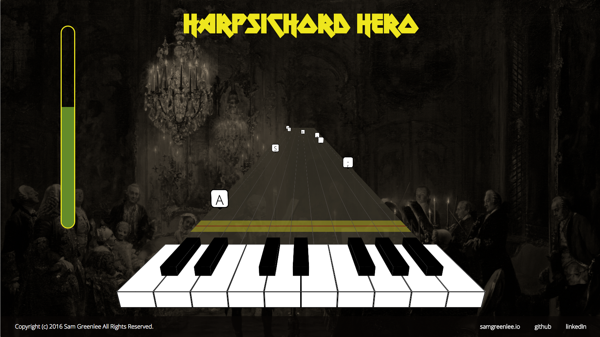

# Harpsichord Hero

## How to play

The gameplay of Harpsichord Hero will be very intuitive to anyone familiar with the Guitar Hero or Rock Band franchise. Notes appear on the screen and fall towards the player. For each note the player must hit the correct key at the right time. Missed notes will cause the player's star meter to deplete. The game is over when either the song ends or the star meter gets too low.

## Techs/Languages/Plugins/APIs used

Harpsichord Hero is mostly implemented in vanilla JavaScript, HTML and CSS3. It also uses jQuery for some of the DOM manipulation.

## Implementation Details

The 3D UI elements are rendered with CSS transformations. Currently notes are generated randomly on a fixed interval. When notes are created, they are added onto a linked-list with a countdown variable and a DOM Node representing the note is inserted into the page. With every animation cycle every note in the linked-list has its countdown decreased and the DOM is updated. When the countdown value for a noted reaches a certain point the player can play the note by hitting the corresponding key on the keyboard. When the player hits a key, an event-listener searches the linked-list for a playable note, removing it if from the DOM and the list if it finds one. If a note reaches the end of the without being played its removed from the linked-list and the DOM and the player's score decreases.

## To-do's

* reimplement part of UI in canvas to improve performance
* parse MIDI files to create more realistic gameplay
* rewrite the app in 100% vanilla JavaScript
