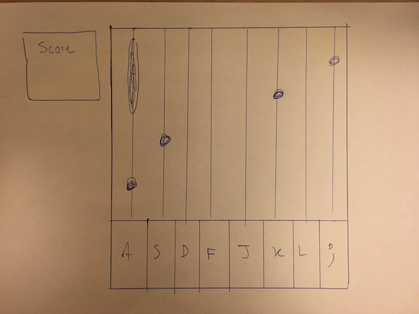

# Keyboard-Hero (working title)

## MVP
When completed, Keyboard-hero will be a fully-functional, two-handed version of the game "Piano Tiles."

## Wireframes

## Timeline

* Phase one:
    - create basic ui
    - write keyboard event listeners and basic game logic
    - write naive random key generator
* Phase two:
    - implement scoring
    - add basic sound effects
* Phase 3:
    - make game increase in difficulty
    - improve music/sfx
